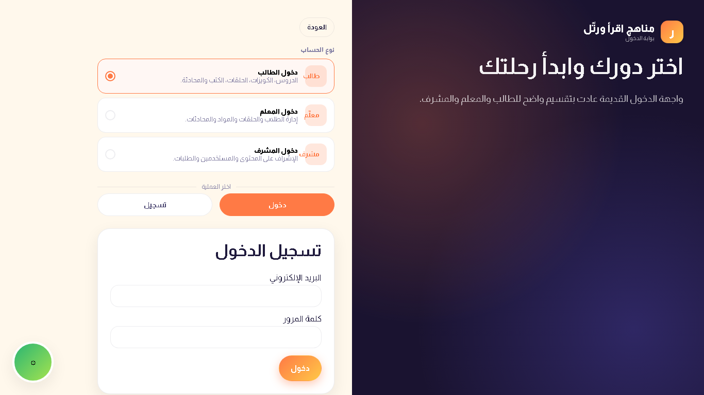

# Case Study: Iqra Rattil

**Currently under development**

**Iqra Rattil** is a full-stack, Arabic-first learning-management platform for the Iqra Rattil curriculum. It gives students, teachers, and supervisors a focused digital space for learning Arabic and the Quran, managing educational activity, and staying connected throughout the learning journey.

- **Role:** Full-stack developer
- **Repository:** [github.com/AbdelrahmanAmin1/iqra-rattil](https://github.com/AbdelrahmanAmin1/iqra-rattil)
- **Focus:** Arabic/RTL education, role-based workflows, and real-time communication

## Overview

Iqra Rattil extends an established Arabic and Quran-learning curriculum into a responsive web product. The platform combines a public-facing introduction to the program with dedicated learning, teaching, and administration experiences—all designed for Arabic right-to-left reading patterns.

## Client Problem

The client needed a single role-aware platform to digitize the Iqra Rattil curriculum and reduce the operational friction of running it across students, teachers, and supervisors. Students needed a clear learning path and visible progress; teachers needed tools to manage learners and sessions; and administrators needed control over users, curriculum content, and academy settings.

The solution also needed to keep communication close to the learning experience, support Arabic-first responsive design, and give the academy a maintainable foundation for publishing content as the program grows.

## Responsibilities

As the full-stack owner, I was responsible for:

- Designing the Arabic/RTL user experience and responsive interface.
- Building the React/Vite frontend and the role-specific student, teacher, and administrator dashboards.
- Designing the Express/TypeScript API, PostgreSQL data model, and Prisma persistence layer.
- Implementing authentication, authorization, teacher approval, validation, uploads, notifications, and real-time messaging.
- Preparing local and cloud deployment configuration, database migrations, and content restoration workflows.

## Solution & Features

### A guided, Arabic-first learning experience

- Responsive RTL landing page that introduces the curriculum, learning levels, books, channel content, and contact journey.
- Student dashboard with structured learning paths, video lessons, quizzes, progress, badges, and upcoming sessions.
- Built-in support for curriculum levels, chapters, lessons, learning materials, and educational resources.


*The public landing experience presents a dense Arabic curriculum in a clear, responsive RTL layout.*

### Purpose-built workflows for every role

- Role-based student, teacher, and administrator sign-in and registration flows.
- Teacher registration approval so supervisors can review access before teachers begin managing students.
- Teacher tools for assigning students, scheduling sessions, recording attendance, uploading materials, and holding private conversations.
- Administrator tools for user approvals and management, curriculum and lesson maintenance, books, videos, and academy settings.



*The sign-in flow makes each user’s role and path into the platform explicit from the first interaction.*

### Communication and continuity

- Private teacher-student message threads with real-time updates.
- In-app notifications with unread counts and preference controls.
- API-driven content and dashboards so academy information is managed centrally instead of remaining hard-coded in the interface.

## Technology & Architecture

Iqra Rattil uses a separated frontend and API architecture:

- **Frontend:** React 18 and Vite, with component-based JSX, custom CSS, responsive layouts, and RTL-oriented interaction design.
- **API:** Express 5 with TypeScript, organized around authentication, public, student, teacher, administrator, and notification routes.
- **Data:** PostgreSQL accessed through Prisma, with models for users, role profiles, curriculum, lessons, quizzes, sessions, attendance, materials, messages, notifications, and settings.
- **Security and validation:** JWT authentication, bcrypt password hashing, Zod request validation, Helmet security headers, and authentication rate limiting.
- **Real-time and files:** Socket.IO for chat and notification events; Multer-backed file uploads for educational materials and content.
- **Delivery:** Docker Compose for the full stack locally, plus deployment configuration for a Vercel frontend, Render API, and Neon PostgreSQL database.

```text
React + Vite client
        |
        | HTTPS / Socket.IO
        v
Express + TypeScript API
        |
        | Prisma
        v
PostgreSQL
```

## Challenges & Solutions

| Challenge | Solution |
| --- | --- |
| Different users need different permissions and dashboards. | Modeled student, teacher, and administrator roles with protected API routes and dedicated dashboard experiences. |
| A student must not be assigned inconsistently across teachers. | Centralized assignment logic in the API and returned clear conflict feedback when an assignment is no longer valid. |
| The product must feel natural for Arabic readers across screen sizes. | Built the interface around RTL hierarchy, Arabic content density, responsive cards, and mobile-aware navigation. |
| Messages and notifications need to remain timely without a page refresh. | Used authenticated Socket.IO connections to deliver new-message and notification events in real time. |
| Content and environments must be repeatable during development and deployment. | Added Prisma migrations, bootstrap and content-restoration scripts, environment validation, Docker configuration, and deployment manifests. |

## Status

**Currently under development**

The platform has a working full-stack foundation and the core student, teacher, administrator, content, and communication flows are implemented. Ongoing work focuses on enriching production content, refining the learning experience, and preparing the product for wider use.

## Key Learnings

- Designing Arabic-first products means treating RTL layout and content hierarchy as core product requirements, not a final styling pass.
- Secure role-based systems work best when roles, data ownership, and approval rules are designed together across the UI, API, and database.
- Real-time features need clear server-side events and client-side state handling to feel reliable rather than disruptive.
- Translating an educational curriculum into software requires balancing structured content, day-to-day teaching operations, and a simple experience for learners.

---

Explore the codebase: [AbdelrahmanAmin1/iqra-rattil](https://github.com/AbdelrahmanAmin1/iqra-rattil)
